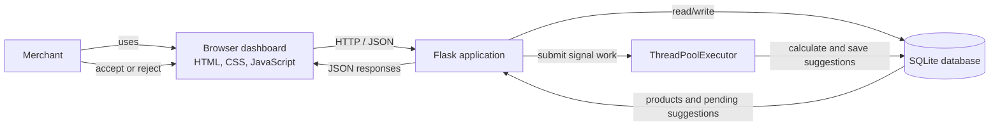
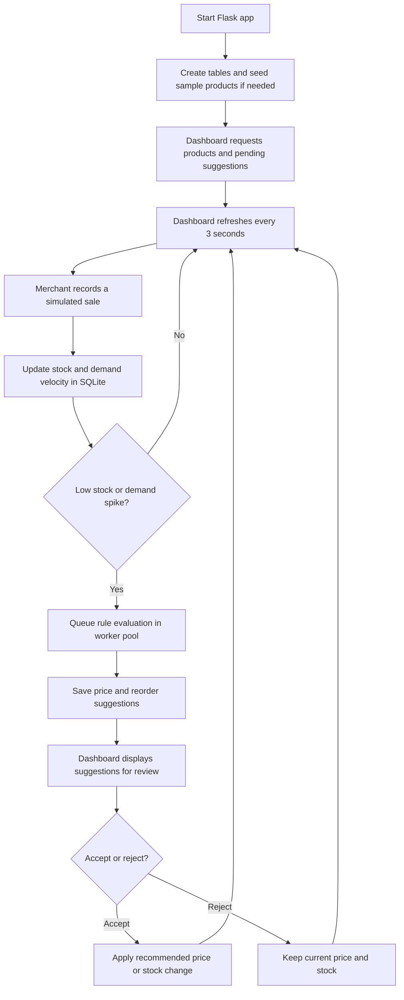

# Zycus_Hackthon

StockPulse is a lightweight inventory monitoring and recommendation demo. It combines a Flask API, a local SQLite database, and a browser dashboard to help a merchant spot low stock and demand changes, then review suggested price or reorder actions.

## Features

- Inventory dashboard with catalog counts, low-stock and high-demand metrics, and category filtering.
- Eight sample products seeded automatically when the database is first created.
- Sale simulation that decrements stock, increments demand velocity, and detects inventory-low or demand-spike signals.
- Rule-based price and replenishment suggestions, including a reason and confidence score.
- Human review controls: accepting a price suggestion updates the product price; accepting a reorder suggestion increases stock; rejecting either leaves inventory and price unchanged.
- Product creation, manual stock updates, and manual recommendation endpoints.
- Dashboard polling every three seconds, with no external queue or database service required.

## Tech Stack

- **Backend:** Python 3.9+, Flask 3.1.1, Python standard library (`sqlite3`, `concurrent.futures`)
- **Frontend:** HTML, CSS, and vanilla JavaScript using the Fetch API
- **Storage:** SQLite, created at `data/stockpulse.db` on startup
- **Background work:** In-process `ThreadPoolExecutor` for recommendation generation

## Architecture



## Working Flow



## Recommendation Rules

- A product below its reorder threshold can receive a 10% price-increase recommendation.
- When product demand is more than twice the category average, it can receive a 5% price-increase recommendation.
- Otherwise, a price suggestion holds the current price.
- Suggested reorder quantity is `max(1, 3 * reorder threshold - current stock)` with a seven-day lead-time estimate.
- Suggestions are advisory; a person must accept them before the suggested price or stock change is applied.

Demand-spike detection compares a product's accumulated `demand_velocity` with the larger of 3 or three times the other products' category average. This demo tracks a cumulative counter, not a time-windowed orders-per-day metric.

## Run Locally

### Windows PowerShell

```powershell
py -m venv .venv
.\.venv\Scripts\Activate.ps1
python -m pip install -r backend/requirements.txt
python backend/app.py
```

### macOS or Linux

```bash
python3 -m venv .venv
source .venv/bin/activate
python -m pip install -r backend/requirements.txt
python backend/app.py
```

Open <http://127.0.0.1:5000>. The database and seed data are initialized automatically. To reset the demo data, stop the server and remove `data/stockpulse.db`; it will be recreated at the next startup. Do not delete the database if it contains data you want to keep.

## HTTP API

All endpoints are served by the Flask app on port 5000. JSON request bodies are used where applicable.

| Method | Path | Purpose |
| --- | --- | --- |
| `GET` | `/api/health` | Health check |
| `GET` | `/products?category=ALL` | List products; optional category filter |
| `POST` | `/products` | Create a product |
| `POST` | `/products/<product_id>/orders` | Record a sale and evaluate signals |
| `PATCH` | `/products/<product_id>/stock` | Set a product's stock level |
| `GET` | `/suggestions?status=PENDING` | List suggestions by status |
| `PATCH` | `/suggestions/<suggestion_id>` | Accept or reject a suggestion |
| `POST` | `/products/<product_id>/suggest-pricing` | Generate manual rule suggestions |
| `POST` | `/products/<product_id>/suggest-reorder` | Generate manual rule suggestions |

## Project Layout

```text
backend/
  app.py             Flask routes, SQLite setup, and recommendation rules
  requirements.txt   Python dependencies
data/                Runtime SQLite database (generated, not committed)
frontend/
  app.js             Dashboard behavior and API requests
  index.html         Dashboard markup
  style.css          Dashboard styling
README.md            Project documentation
```

## Scope and Limitations

This is a local hackathon/demo application, not a production inventory service. The worker queue is in-process and not durable, demand velocity is cumulative rather than time-windowed, and the app has no authentication or authorization. Do not expose it publicly or use its recommendations for live pricing or replenishment without adding appropriate security, operational controls, and business validation.
