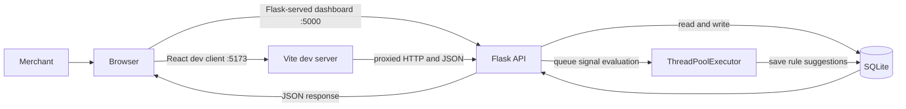
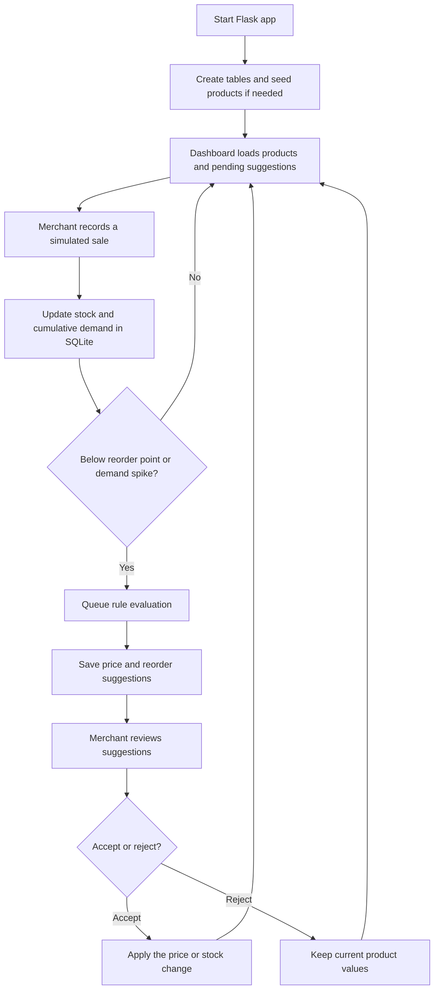

data/                Runtime SQLite database (generated, not committed)
# Zycus_Hackthon | StockPulse

StockPulse is an inventory monitoring demo for a small commerce catalog. The Flask backend stores products and suggestions in SQLite, detects low-stock and demand signals, and produces rule-based price and replenishment recommendations for a person to review.

## Features

- Dashboard metrics for catalog size, low stock, pending suggestions, and high demand.
- Category filtering and automatic dashboard refresh.
- Eight sample products seeded automatically on first launch.
- Sale simulation updates stock and cumulative demand, then checks for inventory-low and demand-spike signals.
- Rule-based price and reorder recommendations with a reason and confidence value.
- Accepting a price suggestion changes the product price; accepting a reorder suggestion adds the recommended stock. Rejecting leaves the product unchanged.
- API support for creating products, setting stock, and manually requesting suggestions.
- React/Vite dashboard source in `ui-src/` in addition to the Flask-served HTML/CSS/JavaScript dashboard in `frontend/`.

## Tech Stack

- **Backend:** Python, Flask 3.1.1, `sqlite3`, `concurrent.futures`
- **Frontend:** HTML, CSS, vanilla JavaScript; React 19 and Vite 8 for the separate `ui-src/` client
- **Database:** SQLite at `data/stockpulse.db`
- **Background processing:** In-process `ThreadPoolExecutor`

## Architecture



The Flask app currently serves `frontend/` at `/`. Vite serves the React source separately during development. Vite's production build is written to `frontend/dist/`; the current Flask app does not serve that directory automatically.

## Working Flow



## Recommendation Rules

- Low stock can produce a 10% price-increase recommendation.
- Demand greater than twice the category average can produce a 5% price-increase recommendation.
- Otherwise, the price suggestion holds the current price.
- Reorder quantity is `max(1, 3 * reorder threshold - current stock)` with a seven-day lead-time estimate.
- The backend detects a demand spike when cumulative `demand_velocity` is greater than `max(3, 3 * category average)`.
- Demand velocity is a cumulative demo counter, not a time-windowed orders-per-day calculation. Recommendations are advisory until accepted.

## Run Locally

Prerequisites: Python 3.9 or newer, and Node.js 20.19+ or 22.12+ for the Vite client.

### 1. Install Python dependencies

From the repository root:

```powershell
py -m venv .venv
.\.venv\Scripts\Activate.ps1
python -m pip install -r backend/requirements.txt
```

On macOS/Linux, activate with `source .venv/bin/activate` instead.

### 2. Start the Flask backend

From the repository root, in one terminal:

```powershell
python backend/app.py
```

The backend and Flask-served dashboard are available at <http://127.0.0.1:5000>. Database setup and sample seeding happen automatically.

### 3. Start the React/Vite client (optional)

In a second terminal:

```powershell
cd ui-src
npm ci
npm run dev
```

Open the URL printed by Vite, usually <http://127.0.0.1:5173>. API requests are proxied to the Flask server on port 5000. To create a production React bundle, run `npm run build` from `ui-src/`; output goes to `frontend/dist/`.

**React integration status:** The React source currently calls `/admin/strategy`, `/products/<id>/snapshots`, and `/chat`, which are not implemented by the current Flask backend. Those React panels will not work until the matching backend routes are added. The Flask-served dashboard uses the supported API below.

To reset demo data, stop Flask and remove `data/stockpulse.db`. It will be recreated on the next launch. Keep the file if you need to preserve local data.

## HTTP API

JSON request bodies are used where applicable.

| Method | Path | Purpose |
| --- | --- | --- |
| `GET` | `/api/health` | Health check |
| `GET` | `/products?category=ALL` | List products, optionally filtered by category or status |
| `POST` | `/products` | Create a product |
| `POST` | `/products/<product_id>/orders` | Record a sale and check inventory/demand signals |
| `PATCH` | `/products/<product_id>/stock` | Set stock level |
| `GET` | `/suggestions?status=PENDING` | List suggestions by status |
| `PATCH` | `/suggestions/<suggestion_id>` | Accept or reject a suggestion |
| `POST` | `/products/<product_id>/suggest-pricing` | Generate manual rule suggestions |
| `POST` | `/products/<product_id>/suggest-reorder` | Generate manual rule suggestions |

## Project Layout

```text
backend/
  app.py              Flask routes, SQLite setup, and recommendation rules
  requirements.txt    Python dependencies
data/                 Runtime SQLite database (created automatically)
frontend/
  app.js              Flask dashboard behavior and API requests
  index.html          Flask dashboard markup
  style.css           Flask dashboard styling
ui-src/
  main.jsx            React dashboard source
  index.html          Vite entry point
  package.json        React/Vite scripts and dependencies
  vite.config.js      Dev API proxy and build output configuration
README.md             Project documentation
```

## Limitations

This is a local hackathon demo, not a production inventory service. It has no authentication, uses an in-process non-durable worker pool, and tracks demand cumulatively. The React UI and current Flask API are not fully aligned; see the integration status above. Add security, durable background processing, business validation, and matching API routes before production use.
